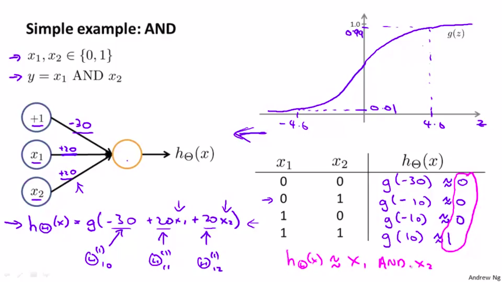

# Artificial Neural Networks
#### Non-Linear Hypothesis
Consider a supervised learning classification problem where you have a training set like this. If you want to apply logistic regression to this problem, one thing you could do is apply logistic regression with a lot of nonlinear features like.  
 
g as usual is the sigmoid function, and we can include lots of polynomial terms like these. And, if you include enough polynomial terms then, maybe you can get a hypotheses that separates the positive and negative examples. This particular method works well when you have only, say, two features - x1 and x2 - because you can then include all those polynomial terms of x1 and x2. But for many interesting machine learning problems, we would have a lot more features than just two.

Example say we have 100 features, x1-x100,, and, **if you were to include all the quadratic terms**, that is the second order polynomial terms, there would be a lot of them. There would be terms like x12,x1x2,x1x3 upto x1x100 and then you have x12, x2x3, x2x4 upto x2x100 and so on. 
*This way for n = 100, you will end up with 5000 features.(O(n2) roguhly n2/2). So including all the quadratic features doesn't seem like a good idea, because that is a lot of features and you might end up overfitting the training set, and it can also be computationally expensive*
- One thing you could do is include only a subset of these, so if you include only the features x12, x22, x32 up to maybe x1002, then the number of features is much smaller, but this is not enough features and certainly won't let you fit the complex data set like above.

**For many machine learning problems, n will be pretty large. Here's an example:**
#### The Problem of Computer Vision
Suppose you want to use machine learning to train a classifier to examine an image and tell whether or not the image is a car. To understand why computer vision is hard let's zoom into a small part of the image like that area where the little red rectangle is. It turns out that where you and I see a car, the computer sees is this matrix, of pixel intensity values that tells us the brightness of each pixel in the image.**So the computer vision problem is to look at this matrix of pixel intensity values, and tell us that these numbers represent the door handle of a car.**  
 

Keeping the pixel1 and pixel2 positions same for the dataset, we'll find is that the cars and non-cars end up lying in different regions of the space, and we need non-linear hypotheses to try to separate out the two classes. 
 

If each images is 50x50 pixels, **dimension of feature space,N = 2500(for grayscale; 7500 for 3 channel RGB)** 
So, feaure vector is the list of the pixel intensities/brightness( values between say 0 to 255) for 2500 pixels. ***So if we try to learn a non-linear hypothesis including all the quadratic features, Total Number of Features = 3 million***

#### NEURAL NETWORKS
The brain does so many different and amazing things. It seems like if you want to mimic the brain you have to write lots of different pieces of software to mimic all of these different fascinating, amazing things(seeing, hearing, taste,do math, speak), but there is this fascinating hypothesis that the way the brain does all of these different things is not with like a thousand different programs, but instead, with just a single learning algorithm. This is just a hypothesis but let me share with you some of the evidence for this. 
>Neuroscientists have done the following fascinating experiments where you cut the wire from the ears to the auditory cortex and you re-wire,in this case an animal's brain, so that the signal from the eyes to the optic nerve eventually gets routed to the auditory cortex. If you do this it turns out, the auditory cortex will learn to see. 

##### MODEL REPRESENTATION
In the Brain, at a simplistic level, a neuron is a computational unit that gets a number of inputs through its input wires(deondrites) and does some computation and then it sends outputs via its axon to other nodes(other neurons in the brain.)

 
- x = [ x1, x2, x3....]  are inputs and theta = [theta1, theta2, theta3,...]  are the weights/parameters. 
- Showing x0(the bias unit/the (+1) unit)depends on notation conveniency.
- Activation function in the neural network terminology is just another term for function for the required non-linearity, g
(z)(sigmoid activation function,etc). 
**FOR OVERSIMPLIFICATION AND UNSERSTANDING PURPOSES: ASSUME g(z) IS THE LOGISTIC/SIGMOID FUNCTION.**

So here are the **computations** represented by the above diagram: 
 

##### FORWARD PROPAGATION: VECTORIZED IMPLEMENTATION
Calculating the value of hypothesis (parameterized by theta), by going from input layer => Hidden Layer(s)(the activation units in them) => output layer, is called Forward Prop.

 
**The above image is for my notes purposes**

 
If you look at the last two layers only, The hypothesis will look a lot like logistic regression where instead of featues x1,x2,x3... we have these features, a1, a2, a3(see image for correct notation) and have capital theta(2) instead of lowercase theta. **The features fed into logistic regression(a1,a2..) are these values computed by the hidden layer. *and they themselves are learned as functions of the input.Concretely, the function mapping from layer 1 to layer 2, is determined by some other set of parameters, theta1.***<b/>
 

>Depending on what parameters is choosen for theta1, complex features can be learned and therefore you can end up with a better hypotheses than if you were constrained to use the raw features x1, x2 or x3 or if you will constrained to choose the polynomial terms. **But instead, this algorithm has the flexibility to try to learn whatever features at once, using these a1, a2, a3 in order to feed into this last unit that's essentially a logistic regression here.**

In ANN architecture with multiple layers, in each layer we can learn even more complex features from the input features recieved from previous layer.

### EXAMPLES
Consider the following problem where we have features x1 and x2 that are binary values: 
In this example, only two positive examples and two negative examples have been drawn. Think of this as a simplified version of a more complex learning problem where we may have a bunch of positive examples in the upper right and lower left and a bunch of negative examples denoted by the circles. **And what we'd like to do is learn a non-linear division of boundary that may need to separate the positive and negative examples.**

 
**Concretely, label class y = x1 XOR x2; It turns out that these specific examples work out a little bit better if we use x1 XNOR x2 
Thus, y = 1 when both x1,x2 are either 0(false) or 1(true) and y = 0 if any one of them is 1(true)**

By adjusting the weights, and x(input feature vector) values:

 
 
 

**Finally,** 
 
>And this is a sort of intuition about why neural networks can compute pretty complicated functions.  That when you have multiple layers you have relatively simple function of the inputs of the second layer. But the third layer I can build on that to complete even more complex functions, and then the layer after that can compute even more complex functions.

### [NEURAL NETWORKS for MULTI-CLASSIFICATION PROBLEM](https://developers.google.com/machine-learning/crash-course/multi-class-neural-networks/video-lecture)
For Example:Hand-Written Digit Recognition, 

The way we do multiclass classification in a neural network is essentially an extension of the one versus all method.

**Let's say that we have a computer vision example, where we're trying to recognize, four categories of objects: Given an image, decide if it is a pedestrian, a car, a motorcycle or a truck.** 

 
So, the output now is actually needs to be a vector of four numbers and what we try to do is:
- get the 1st output unit to classify: is the image a pedestrian, yes or no.
- get the 2mrd unit to classify: is the image a car, yes or no.
- get the 3rd unit to classify: is the image a motorcycle, yes or no, and
- get the 4th unit to classify: is the image a truck, yes or no.
And thus, when the image is of a pedestrian, we would ideally want the network to output [1, 0, 0, 0, ] when it is a car we want it to output [ 0, 1, 0, 0,] when this is a motorcycle, we want it to output[ 0, 0, 1, 0] and so on.

**So this is just like the "one versus all" method that I described in my earlier project on [logistic regression](https://github.com/kunal-visoulia/Classification-Using-Logistic-Regression), and here we have essentially four logistic regression classifiers, each of which is trying to recognize one of the four classes that we want to distinguish amongst**

 

### COST FUNCTION FOR FITTING ANN PARAMETERS
**here K = number of activation units in output layer**
 
here we are summing that cost function over each of my K output units in turn.

### [BACKPROPAGATION IN ANN](https://medium.com/spidernitt/breaking-down-neural-networks-an-intuitive-approach-to-backpropagation-3b2ff958794c)
"Backpropagation" is neural-network terminology for minimizing our cost function, just like what we were doing with gradient descent in logistic and linear regression. 

- **The first thing we do is we apply forward propagation in order to compute whether a hypotheses actually outputs given the input.** So this is our vectorized implementation of forward propagation and it allows us to compute the activation values for all of the neurons in our neural network. 
 

- **Next, in order to compute the derivatives, we're going to use back propagation.**  
 
.* = element wise multiplication; red shows vectorized implementation(automatically does an update for all values of i and j.) 
There is no delta1 term, because the first layer corresponds to the input layer and that's just the feature we observed in our training sets, so that doesn't have any error associated with that.
>**Note for me**:And by the way, so far I've been writing the delta values only for the hidden units, but excluding the bias units. Depending on how you define the backpropagation algorithm, or depending on how you implement it, you know, you may end up implementing something that computes delta values for these bias units as well. The bias units always output the value of +1, and they are just what they are, and there's no way for us to change the value. And so, depending on your implementation of back prop, the way I usually implement it, I do end up computing these delta values, but we just discard them, we don't use them because they don't end up being part of the calculation needed to compute a derivative

 
The case of j equals zero corresponds to the bias term so when j equals zero that's why we're missing is an extra regularization term.

 
 we do forward propagation and backpropagation on one example at a time. 
 
### GRADIENT CHECKING
>Back prop as an algorithm has a lot of details and can be a little bit tricky to implement. And one unfortunate property is that there are many ways to have subtle bugs in back prop. So that if you run it with gradient descent or some other optimizational algorithm, it could actually look like it's working. And your cost function, J of theta may end up decreasing on every iteration of gradient descent. *But this could prove true even though there might be some bug in your implementation of back prop*. So that it looks J(theta) is decreasing, but you might just wind up with a neural network that has a higher level of error than you would with a bug free implementation. And you might just not know that there was this subtle bug that was giving you worse performance. 
So, today every time I implement back propagation or a similar gradient  on a neural network or any other reasonably complex model, I always implement gradient checking. And if you do this, it will help you make sure and sort of gain high confidence that your implementation of four prop and back prop or whatever is 100% correct.

let's say that I want to estimate the derivative of this function at this point and so the derivative is equal to the slope of the tangentat that point. Here's a procedure for numerically approximating the derivative. 

 
This uses the two sided difference(more accurate).

#### Random Initialization
Initializing all theta weights to zero does not work with neural networks. When we backpropagate, all nodes will update to the same value repeatedly. Instead we can randomly initialize our weights for our theta matrices using the following method:

Concretely, the problem was saw on the previous slide is something called the problem of symmetric ways, that's the ways are being the same. So this random initialization is how we perform symmetry breaking.  
 
Hence, we initialize each theta weight to a random value betweem [-epsilon, epsilon] (this epsilon here has nothing to do with the epsilon that we were using when we were doing gradient checking.).

